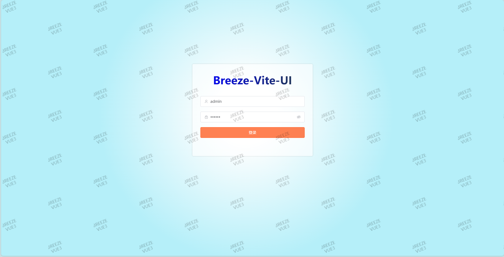
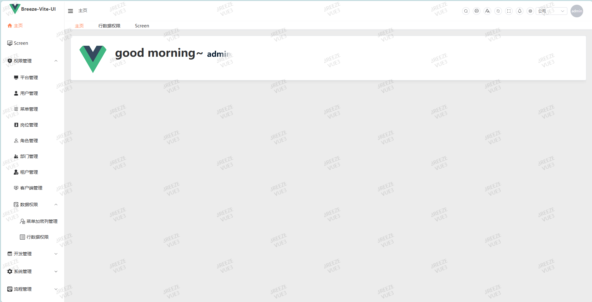

# breeze-vite-ui-satoken-sso-client 客户端模块

### 平台简介

##### Breeze-vite-ui-satoken-sso-client 是一个基于 Vue 3、TypeScript、Vite 和 Element Plus 的权限管理平台。它提供了现代化的用户界面，适用于构建和管理权限系统。对应后端项目 breeze-boot-satoken-sso。

- 前端采用Vue、Element UI PLUS、VITE、TypeScript。
- 支持按钮级别的权限控制。
- 支持加载动态权限菜单。
- 后端代码，请移步。
  - [github JDK17](https://github.com/breeze-boot/breeze-boot-satoken-sso.git)
  - [gitee JDK17](https://gitee.com/breeze-boot/breeze-boot-satoken-sso.git)
- 前端代码，请移步。
  - sso 服务端
  - [github：vue + vite + TS 版本](https://github.com/breeze-boot/breeze-vite-ui-satoken-sso.git)
  - [gitee: vue + vite + TS 版本](https://gitee.com/breeze-boot/breeze-vite-ui-satoken-sso.git)
  - sso 客户端：此项目
  - [github：vue + vite + TS 版本](https://github.com/breeze-boot/breeze-vite-ui-satoken-sso.git)
  - [gitee: vue + vite + TS 版本](https://gitee.com/breeze-boot/breeze-vite-ui-satoken-sso.git)

### 启动项目
- 分别启动server端和要运行的client端。
  - BreezeBootSsoServerApplication ------------------------------- （sso 服务端）
  - BreezeSpringSecuritySsoClientApplication ------------------- （sso 客户端 springSecurity版本nosdk集成版本）
  - BreezeSsoClientApplication --------------------------------------- （sso 客户端 sa-token版本）
- 再启动前端项目时，需要先启动后端项目，再启动前端项目。
  - breeze-vite-ui-satoken-sso ---------------------------------------- （sso 服务端）
  - breeze-vite-ui-satoken-sso-client ---------------------------------（sso 客户端）

## 推荐的开发环境配置

- [VS Code](https://code.visualstudio.com/) + [Volar](https://marketplace.visualstudio.com/items?itemName=Vue.volar) (and disable Vetur) + [TypeScript Vue Plugin (Volar)](https://marketplace.visualstudio.com/items?itemName=Vue.vscode-typescript-vue-plugin).

## Type Support For `.vue` Imports in TS

TypeScript 默认无法处理 .vue 导入的类型信息，因此我们将 tsc CLI 替换为 vue-tsc 进行类型检查。在编辑器中，我们需要安装 TypeScript Vue Plugin (Volar) 插件，以便让 TypeScript 语言服务识别 .vue 类型。

如果独立的 TypeScript 插件速度不够快，Volar 还实现了一个 Take Over Mode，它的性能更好。你可以通过以下步骤启用它：

禁用内置的 TypeScript 扩展
从 VSCode 的命令面板中运行 Extensions: Show Built-in Extensions
找到 TypeScript and JavaScript Language Features，右键点击并选择 Disable (Workspace)
通过从命令面板中运行 Developer: Reload Window 重新加载 VSCode 窗口。

- [WebStorm](https://www.jetbrains.com/webstorm/download)
- [Idea](https://www.jetbrains.com/idea/download) + Vue插件

### 特别鸣谢：

# 请遵循 Apache 2.0 协议

### 前端界面相关

### 登录页

### 首页

